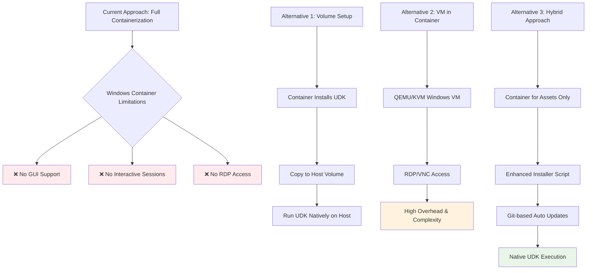
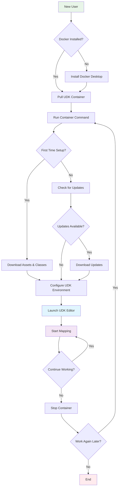
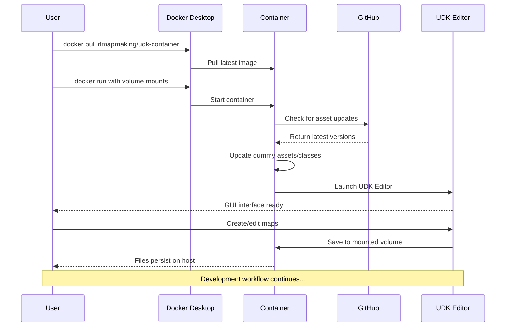
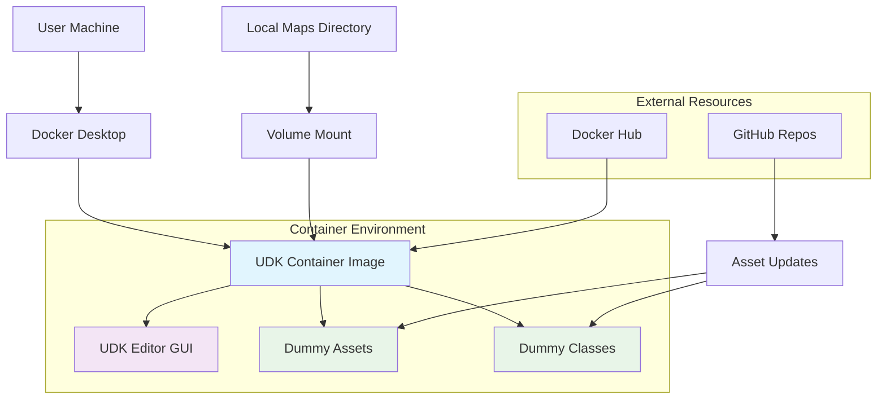
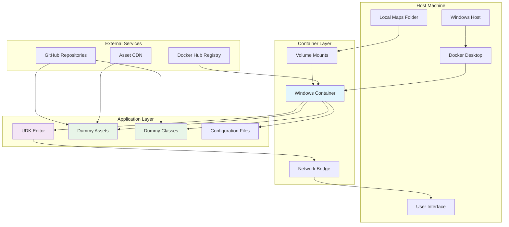
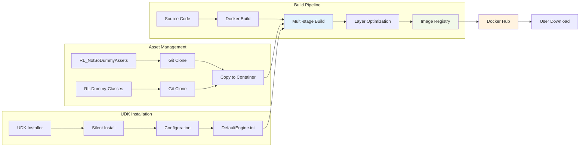
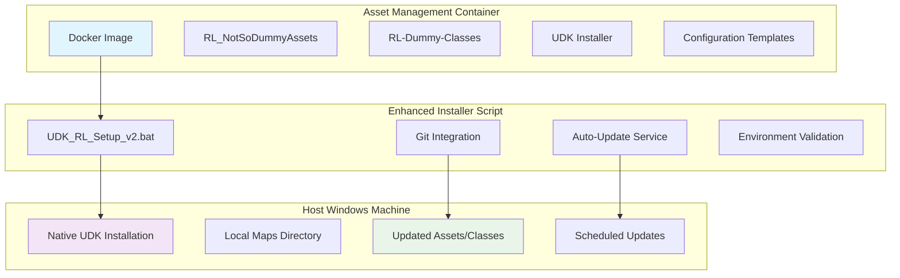

# PRD: Containerized UDK Environment for Rocket League Mapmaking

## 1. Product overview
### 1.1 Document title and version
- PRD: Containerized UDK Environment for Rocket League Mapmaking
- Version: 1.0

### 1.2 Product summary
This project aims to create a Docker-based solution for Rocket League mapmakers to maintain consistent UDK environments. The containerized environment will include UDK installation, dummy assets, and dummy classes, with automatic updates from GitHub repositories.

The solution will eliminate setup inconsistencies and simplify the onboarding process for new mapmakers. By containerizing the environment, we ensure all users work with identical configurations, reducing "works on my machine" issues and streamlining collaboration.

## 2. Goals
### 2.1 Business goals
- Standardize UDK environments across all mapmakers
- Reduce setup time from hours to minutes
- Simplify updates to dummy assets/classes
- Eliminate GitHub download limits for assets
- Improve collaboration consistency

### 2.2 User goals
- Single-command environment setup
- Automatic updates to assets and classes
- Consistent editor behavior across machines
- Easy version rollback capability
- Portable development environment

### 2.3 Non-goals
- Containerizing the game runtime itself
- Supporting Linux/macOS UDK environments
- Creating a cloud-based editing solution
- Replacing version control for map files
- Supporting non-Rocket League UDK projects

### 2.4 ⚠️ CRITICAL REVISION NEEDED
**After research, the original Docker GUI approach is not technically feasible.** Windows containers do not support GUI applications like UDK. We need to pivot to one of these alternatives:

**Recommended Pivot: Enhanced Installer with Container-managed Assets**
- Use containers for asset management and distribution
- Maintain existing installer approach with Git automation
- Provide containerized build/CI pipeline for advanced users

#### Technical Limitation Analysis

## 3. User personas
### 3.1 Key user types
- New mapmakers
- Experienced map creators
- Community contributors
- Tutorial creators

### 3.2 Basic persona details
- **New Mapmaker**: Needs quick setup to start creating immediately
- **Veteran Creator**: Requires consistent environment for complex projects
- **Community Contributor**: Shares assets and needs reproducible setups
- **Tutorial Author**: Requires standardized environment for teaching

### 3.3 Role-based access
- **Basic User**: Run UDK Editor with preconfigured assets
- **Advanced User**: Customize container builds for specific needs
- **Maintainer**: Update base images and asset repositories

## 4. Functional requirements
- **Core Containerization** (Priority: High)
  - Windows-based Docker image with UDK installation
  - Preconfigured dummy assets and classes
  - Git integration for asset updates
- **User Experience** (Priority: High)
  - Single-command environment launch
  - Volume mounting for map files
  - GUI access to UDK Editor
- **Automation** (Priority: Medium)
  - Auto-update assets on container start
  - Version-tagged image builds
  - Health checks for UDK services
- **Deployment** (Priority: Medium)
  - Docker Hub integration
  - Build pipeline for image updates
  - Size-optimized image layers

## 5. User experience
### 5.1. Entry points & first-time user flow

#### User Journey Flow

1. Install Docker Desktop
2. Run setup command
3. Launch container with single command
4. Start mapping immediately

### 5.2. Core experience

#### User Workflow Sequence

- **Environment Setup**: Users run `docker pull rlmapmaking/udk-container` then `docker run...`
  - Provide clear documentation for Docker setup
- **Daily Usage**: Users run container with local maps directory mounted
  - Preserve UDK preferences between sessions
- **Asset Updates**: Container checks for updates on startup
  - Provide update logs for transparency

### 5.3. Advanced features & edge cases
- Offline mode with cached assets
- Version-pinned asset repositories
- Multi-container setups for CI/CD
- Headless operation for automated builds

### 5.4. UI/UX highlights
- Standardized UDK interface
- Status indicators for asset updates
- Container logging integration
- Preserved UI preferences between sessions

## 6. Narrative
Alex is a new Rocket League mapmaker who wants to create custom arenas but struggles with complex UDK setup. After hours of troubleshooting environment issues, Alex discovers the containerized UDK solution. With Docker already installed, Alex runs two commands and gets a fully configured mapping environment. The container automatically keeps assets updated, and Alex can focus on creative work instead of setup. When sharing maps with teammates, everyone has identical environments, eliminating compatibility issues.

## 7. Success metrics
### 7.1. User-centric metrics
- 90% reduction in setup time
- 75% decrease in environment-related issues
- 60% faster onboarding for new mappers
- 4+ star community rating

### 7.2. Business metrics
- 50% more active mapmakers
- 30% increase in asset update adoption
- 25% reduction in support requests

### 7.3. Technical metrics
- Image size under 5GB
- Startup time < 30 seconds
- Asset update completion < 2 minutes
- 99% container reliability rate

## 8. Technical considerations

### 8.0. System Architecture Overview

The following diagram shows the high-level architecture of the containerized UDK system:

### 8.1. Integration points
- GitHub for asset repositories
- Docker Hub for image distribution
- UDK installation automation
- Windows container services

### 8.2. Data storage & privacy
- Ephemeral container design
- Volume mounts for persistent data
- Secure credential management
- GDPR-compliant logging

### 8.3. Scalability & performance

#### Container Layer Architecture

- Layer caching for fast builds
- Multi-stage builds for size optimization
- Parallel asset fetching
- Resource limits configuration

### 8.4. Critical challenges and limitations

**⚠️ MAJOR ISSUE: Windows Containers Do Not Support GUI Applications**

Based on current Windows container architecture, **this approach may not be viable** for UDK. Key blockers:

- **No GUI Support**: Windows containers explicitly do not support interactive GUI sessions [per Docker forums](https://forums.docker.com/t/windows-with-gui/139115) and [Microsoft documentation](https://github.com/microsoft/Windows-Containers/issues/306)
- **UDK Requirement**: UDK (Unreal Development Kit) is a Windows-exclusive GUI application that requires interactive desktop environment
- **No RDP/Interactive Sessions**: Microsoft discontinued RDP and GUI support in Windows containers

**Alternative Approaches to Consider:**

1. **Volume-based Setup Container**: 
   - Container sets up UDK environment and copies to host
   - User runs UDK natively on Windows host with containerized assets
   
2. **Remote Desktop Solution**:
   - Full Windows VM with UDK inside container (using QEMU/KVM)
   - Requires significant overhead and complexity
   
3. **Hybrid Approach**:
   - Container manages assets/dependencies only
   - Enhanced installer script with Git-based updates

**Other Technical Challenges:**
- Large image sizes (5GB+ for UDK + dependencies)
- UDK licensing considerations for redistribution
- Windows container host requirements
- Performance overhead for GUI virtualization

## 9. Milestones & sequencing
### 9.1. Project estimate
- Medium: 3-5 weeks

### 9.2. Team size & composition
- Small Team: 2 people
  - 1 DevOps engineer
  - 1 UDK expert

### 9.3. Suggested phases

#### Build Pipeline Architecture

- **Phase 1**: Core container implementation (2 weeks)
  - Dockerfile creation
  - UDK silent installation
  - Basic asset integration
- **Phase 2**: User experience polish (1 week)
  - Volume mounting
  - Update automation
  - Documentation
- **Phase 3**: Advanced features (1 week)
  - CI/CD pipeline
  - Version tagging
  - Community testing

## 10. User stories
### 10.1. Run UDK Editor in container
- **ID**: US-001
- **Description**: As a mapmaker, I want to run UDK Editor from a Docker container so I have a consistent environment
- **Acceptance criteria**:
  - UDK launches with GUI access
  - All essential editor features work
  - Performance matches native installation

### 10.2. Automatic asset updates
- **ID**: US-002
- **Description**: As a mapmaker, I want automatic dummy asset updates so I always have the latest versions
- **Acceptance criteria**:
  - Container checks GitHub on startup
  - Updates applied when available
  - Update logs visible in console

### 10.3. Persistent map storage
- **ID**: US-003
- **Description**: As a mapmaker, I want to mount local directories so my map files persist outside the container
- **Acceptance criteria**:
  - Maps directory mountable at runtime
  - File changes reflect immediately
  - No permission issues

### 10.4. Version-pinned environments
- **ID**: US-004
- **Description**: As an advanced user, I want to specify asset versions so I can maintain compatibility
- **Acceptance criteria**:
  - Tag-based asset selection
  - Commit hash pinning
  - Fallback to latest

### 10.5. Multi-container testing
- **ID**: US-005
- **Description**: As a developer, I want headless containers so I can run automated map tests
- **Acceptance criteria**:
  - CLI-only operation mode
  - Automated build triggering
  - Test results output

## 11. Revised Implementation Strategy

Given the Windows container GUI limitations discovered during research, we recommend pivoting to a **Hybrid Container-Enhanced Installer Approach**:

### 11.1. Revised Architecture

### 11.2. Implementation Benefits
- **Maintains Container Benefits**: Version control, consistency, automation
- **Avoids GUI Limitations**: UDK runs natively on Windows host
- **Simplified Distribution**: Container packages all dependencies
- **Automated Updates**: Git-based asset synchronization
- **Lower Complexity**: No VM overhead or networking issues

### 11.3. User Experience Impact
- **Setup**: `docker run rlmapmaking/udk-installer` extracts environment to host
- **Daily Use**: Native UDK performance with auto-updating assets
- **Updates**: Background service keeps assets current via Git
- **Consistency**: All users get identical base configurations